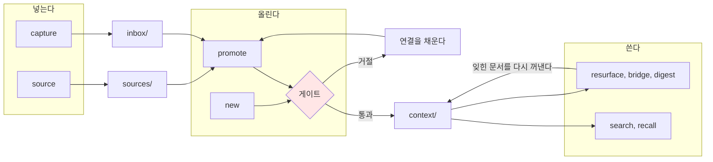
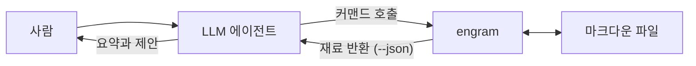

# engram

**메모는 쌓이는데 지식은 안 쌓이는 문제**를 다루는 도구다. 마크다운 위키에 승급 파이프라인을 두고, 그 파이프라인을 사람의 의지가 아니라 코드가 강제한다.

> engram은 기억이 뇌에 남기는 물리적 흔적을 뜻한다. second brain을 표방하는 도구의 실체가 무엇인지 이름이 그대로 말한다. 흔적은 저장이 아니라 **연결**로 남는다. 이 도구가 연결을 요구하는 이유다.

## 무엇이 다른가

노트 앱은 넣기 쉽다. 그래서 넣기만 하고 끝난다. 6개월 뒤 남는 것은 검색되지 않는 메모 더미다.

engram은 문서가 `context/`로 올라갈 때 **다른 문서와 연결되어 있는지 검사하고, 아니면 거절한다.**

```
$ engram new "지식 승급 파이프라인" --type concept
Error: 승급 게이트를 넘지 못했다: 위키링크가 0개로 min_wikilinks 2개에 못 미친다
related 필드나 본문에 위키링크를 2개 더 추가한다. 이 자리에서 채우려면 --related <슬러그>를 반복해 준다
```

거절 사유는 하나뿐이다. 연결 없는 고립 노드만 막는다. 길이도 형식도 태그도 막지 않는다. **거절이 많으면 사용자는 우회로를 찾는다.**

이 게이트 하나가 다른 PKM 도구와의 유일한 차별점이다. 검색도 재발견도 웹 UI도 다른 도구에 다 있다.

## 설치

```sh
go install github.com/neocode24/engram/cmd/engram@latest
```

순수 Go이며 `CGO_ENABLED=0`으로 빌드된다. 런타임 의존성이 없다. Windows, macOS, Linux의 amd64와 arm64를 지원한다.

## 5분 둘러보기

### 위키를 만든다

```
$ engram init ~/wiki
위키를 초기화했다: /Users/me/wiki (프리셋: education)

디렉토리:
  inbox/       새 자료가 들어오는 곳
  sources/     원본을 보존하는 곳
  context/     정리된 문서가 사는 곳
  archive/     승급에서 물러난 문서가 가는 곳

파일:
  engram.yaml  위키 설정. 축과 임계값을 여기서 조정한다
  index.md     첫 문서. 위키 소개로 채운다
  .gitignore   .engram/ 캐시 디렉토리를 git에서 제외한다
```

### 마찰 없이 받는다

```
$ engram capture --title "LLM 게이트웨이 조사" "여러 프로바이더를 한 엔드포인트로 묶는 패턴."
inbox에 넣었다: inbox/2026-03-05-llm-게이트웨이-조사.md
```

`capture`는 아무것도 검증하지 않는다. 회의 중에 쓰는 명령이라 마찰이 있으면 안 된다.

### 원본은 따로 보존한다

```
$ engram source --title "게이트웨이 벤치마크" --created 2026-02 --ref "https://example.com/report" "지연시간 측정 원문."
source에 넣었다: sources/2026-02-게이트웨이-벤치마크.md
```

### 연결을 채워 올린다

```
$ engram promote inbox/2026-03-05-llm-게이트웨이-조사.md --type concept \
    --related index --related 2026-02-게이트웨이-벤치마크
context로 올렸다: context/llm-게이트웨이-조사.md
문서 종류: concept
게이트: 링크 2개, 대상 2개, 기준 2개
다음: engram lint로 승급 문서의 스키마를 확인한다
```

### 지금 무엇을 해야 하는지 본다

```
$ engram status
현황
  inbox 0, source 1, context 1, archive 0 문서
  위키링크 2개, 고아 문서 0개
  lint: 파일 3개, error 0, warn 0, reject 0 (상세는 engram lint)

적체 압력 (기준 2026-03-10)
  inbox 문서 0개
  지금 승급할 수 있는 문서 0개

다음 행동
  - engram capture
    inbox 가 비었다. 새 메모를 받아 파이프라인을 돌린다
```

## 지식의 성숙 단계

디렉토리는 분류함이 아니라 **성숙 단계**다. 문서는 아래로 갈수록 검증된 지식이 된다.

| 디렉토리 | 단계 | 성격 | 검증 |
|---|---|---|---|
| `inbox/` | 러프 캡처 | 임시. 처리되면 비워진다 | 없음 |
| `sources/` | 원본 보존 | append-only. 본문을 고치지 않는다 | 스키마 |
| `context/` | 정리된 지식 | 재사용 가능한 결론 | 스키마 + **게이트** |
| `archive/` | 수명 종료 | 이력으로만 남는다 | 스키마 |

`sources/`에는 `updated` 필드를 쓰지 않는다. 오타 하나 고친 것이 신선도를 오해하게 만들기 때문이다.

각 문서는 YAML 프론트매터로 상태를 갖는다.

```yaml
---
type: concept
artifact_stage: context
status: promoted
topics: [llm, gateway]
form: note
derived_from:
  - sources/2026-02-게이트웨이-벤치마크.md
related:
  - "[[index]]"
indexable: true
---
```

## 파이프라인

넣는 것만이 파이프라인이 아니다. **넣고, 올리고, 다시 만나는** 순환이 전부다.



붉은 게이트가 유일한 관문이다. `context/`로 들어가는 모든 경로가 이 문을 지난다.

**재발견이 나머지 절반이다.** 쌓기만 하고 다시 안 보면 위키는 무덤이 된다. `resurface`는 오래 안 본 문서를, `bridge`는 유사한데 링크가 없는 쌍을, `digest`는 기간 내 변화를 꺼낸다. 셋 다 후보와 근거만 반환하고 문장을 만들지 않는다.

## engram의 역할 경계

**engram은 LLM을 부르지 않는다.** API key도, OAuth 토큰도, 프로바이더 설정도 보관하지 않는다.

호출 방향이 반대다. 이미 열려 있는 에이전트 세션이 engram을 부른다.



| 하는 일 | 소유 |
|---|---|
| 게이트 판정, lint, 스키마 검증 | **engram** |
| 검색, 링크 그래프, 재발견 후보 선정 | **engram** |
| 회의록 요약, 분류 제안, 다이제스트 산문 | 에이전트 |

경계는 "같은 입력에 같은 출력이 나오는가" 하나로 갈린다. 결정론적인 것은 코드가, 판단은 사람이나 에이전트가 맡는다.

그래서 조회 커맨드는 완성된 산문이 아니라 **재료**를 반환한다. `--json`은 부가 기능이 아니라 에이전트용 주 경로다.

에이전트가 쓸 수 있는 범위는 `inbox/`까지다. `context/`로 올리려면 게이트를 지나야 한다. 에이전트가 `context/`에 직접 쓸 수 있게 되는 순간 이 도구의 존재 이유가 사라진다.

## 커맨드

| 커맨드 | 하는 일 |
|---|---|
| `init` | 새 위키를 만든다. 프리셋 3종 |
| `capture` | 검증 없이 `inbox/`에 받는다 |
| `source` | `sources/`에 원본을 확정한다 |
| `promote` | 기존 문서를 `context/`로 올린다. 게이트를 지난다 |
| `new` | 처음부터 검수된 지식으로 `context/`에 쓴다. 게이트를 지난다 |
| `lint` | 스키마와 링크 무결성을 검사한다 |
| `status` | 현황과 적체 압력, 다음 행동 |
| `doctor` | 환경과 설정을 진단한다. 항목마다 복구 조치 |
| `version` | 버전과 빌드 정보 |

전역 플래그는 둘이다. `--json`은 기계 판독 출력이고, `--now`는 기준 시각을 고정해 결과를 결정론적으로 만든다.

`promote`는 출발지에 따라 동작이 다르다. `inbox/` 문서는 **이동**하고 `sources/` 문서는 **파생**을 만든다. 원본 보존 계층을 옮기면 그 계약이 깨지기 때문이다. 파생은 `derived_from`과 `derived_context`로 양방향 기록된다.

## 설정

위키 루트의 `engram.yaml` 하나다. git에 커밋되어 팀이 공유한다.

```yaml
preset: education

# taxonomy. topics는 개방 집합이고 forms는 폐쇄 집합이다.
topics: [llm, gateway]
forms: [note, report]

# 임계값. min_wikilinks만 승급 거절 사유이고 나머지는 경고에 쓰인다.
min_wikilinks: 2    # promote 게이트. 0으로 두면 게이트가 꺼진다
stale_days: 90      # 재발견 대상 판정 기준 일수
max_lines: 1000     # 문서 길이 경고 상한
broad_topic_pct: 25 # 광범위 주제 비율 경고 상한(퍼센트)
```

프리셋은 스키마 축의 개수를 정한다. `personal`이 `education`에 포함되고 `education`이 `team`에 포함된다. 기본값은 `education`이다.

| 프리셋 | 쓰는 경우 |
|---|---|
| `personal` | 혼자 쓰는 위키. 축이 가장 적다 |
| `education` | 입력 경로와 승급 추적이 필요할 때 |
| `team` | 업무 자료와 개인 자료가 섞일 때. 민감도 축이 켜진다 |

포함 관계를 지키므로 프리셋 상향은 필드 추가만으로 끝난다.

`topics`는 열려 있고 `forms`는 닫혀 있다. lint는 `forms` 위반을 오류로, `topics` 신규 값을 경고로 다룬다. 이 구분이 없으면 오타로 생긴 분류가 조용히 자리를 잡는다.

## 현재 상태

**0.1 마일스톤 구현 중이다.** 위 커맨드 아홉이 동작한다.

조회 계열(`search`, `recall`, `backlinks`)과 재발견 계열(`resurface`, `bridge`, `digest`)은 아직 없다. 파이프라인 도식의 "쓴다" 절반이 비어 있다는 뜻이다. 마일스톤별 범위는 [design.md](docs/design.md)에 있다.

## 문서

| 문서 | 내용 |
|---|---|
| [architecture.md](docs/architecture.md) | 동작 구조 전체. mermaid 도식 10종 |
| [design.md](docs/design.md) | 커맨드 체계, 설정, 마일스톤 |
| [journeys.md](docs/journeys.md) | 사용자 여정 24개 |
| [decisions/](docs/decisions/README.md) | ADR. 설계 결정과 개정 이력 |
| [roadmap.md](docs/roadmap.md) | 지금 무엇을 할 것인가 |
| [AGENTS.md](AGENTS.md) | 이 저장소에서 작업하는 에이전트의 계약 |

설계 근거가 궁금하면 ADR을 읽는 편이 빠르다. 왜 게이트가 하나뿐인지, 왜 LLM을 부르지 않는지, 왜 빈 위키에서는 게이트가 유예되는지가 전부 기록되어 있다.

## 라이선스

[Apache License 2.0](LICENSE)
