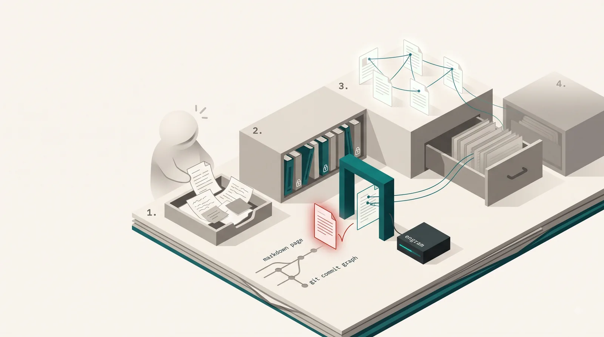
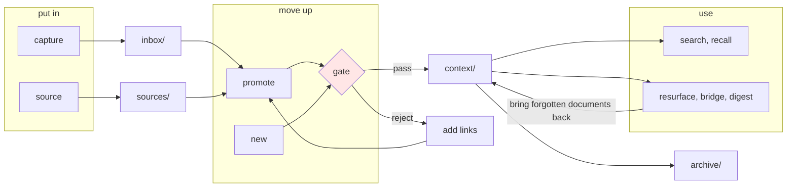

# engram

English | [한국어](docs/ko-KR/README.md)

[](https://github.com/neocode24/engram/actions/workflows/ci.yml)
[](go.mod)
[](LICENSE)

A CLI for the problem of **notes that pile up while knowledge never accumulates**. It puts a promotion pipeline on top of a markdown wiki and lets code, not willpower, enforce it. A document matures from `inbox` through `sources` into `context`, and retires to `archive` when its life is over. Search and rediscovery close the loop.



Knowledge does not live in a chat window or inside a model. It lives in **markdown files you own**. The LLM is a worker in that space, not the container. The container is not a dumping ground but an asset with a schema, stages, history, and an admission rule, and engram enforces that management in code. This is what "second brain" means here.

> An engram is the physical trace a memory leaves in the brain. The trace is not storage but **connection**. That is why this tool demands connections.

The command output in this README is Korean, because the tool speaks Korean to its users today. Each block is preceded by a short English gloss.

## What is different

Note apps make it easy to put things in. So people put things in and stop there. Six months later what remains is a heap of notes that search cannot find.

When a document moves up into `context/`, engram asks for one thing only: at least two links to other documents.

```
$ engram promote inbox/2026-08-16-llm-게이트웨이-조사.md --type concept
Error: 승급 게이트를 넘지 못했습니다: 위키링크가 0개로 min_wikilinks 2개에 못 미칩니다
related 필드나 본문에 위키링크를 2개 더 추가하세요.
이 자리에서 채우려면 --related <슬러그>를 반복해 주세요
```

Gloss: "Promotion gate not passed: 0 wikilinks, below min_wikilinks 2. Add 2 more wikilinks in the related field or the body. To fill them here, repeat --related <slug>."

That is the only reason for rejection. Length, format, and tags are never checked, because the more a tool rejects, the sooner people start working around it. Search, rediscovery, and a web viewer exist in other tools too; the gate that opens and closes promotion in code is what makes engram different.

### Maturity stages



1 inbox, 2 sources, 3 context, 4 archive. The gate sits in front of 3.

Directories are not categories. They are **maturity stages**. The further down the table, the more vetted the knowledge.

| Directory | Stage | Character | Checked by |
|---|---|---|---|
| `inbox/` | rough capture | temporary; emptied as items are processed | nothing |
| `sources/` | preserved originals | append-only; the body is never edited | schema |
| `context/` | curated knowledge | conclusions you can reuse | schema + **gate** |
| `archive/` | end of life | kept as history; links do not break | schema |

`sources/` documents never carry an `updated` field. Fixing one typo would make the document look fresh when it is not.

Every document carries its state in YAML frontmatter.

```yaml
---
type: concept
artifact_stage: context
status: promoted
topics: [llm, gateway]
form: note
derived_from:
  - sources/2026-08-게이트웨이-벤치마크.md
related:
  - "[[index]]"
indexable: true
---
```

## Install

```sh
go install github.com/neocode24/engram/cmd/engram@latest
```

The core is pure Go with no CGO. There are no runtime dependencies, so it builds wherever Go builds.

Or build from source.

```sh
git clone https://github.com/neocode24/engram.git
cd engram
go build ./cmd/engram
```

## Five minutes, first promotion

Start from an empty directory and reach the first promotion. Every line of output below is a real run.

### Create a wiki

Gloss: "Initialized wiki: wiki (preset: personal)", then the four directories, the three files (`engram.yaml`, `index.md`, `.gitignore`), and three next steps.

```
$ engram init wiki
위키를 초기화했습니다: wiki (프리셋: personal)

디렉토리:
  inbox/       새 자료가 들어오는 곳
  sources/     원본을 보존하는 곳
  context/     정리된 문서가 사는 곳
  archive/     승급에서 물러난 문서가 가는 곳

파일:
  engram.yaml  위키 설정. 속성과 임계값을 여기서 조정하세요
  index.md     첫 문서. 위키 소개로 채우세요
  .gitignore   .engram/ 캐시 디렉토리를 git에서 제외합니다

다음 단계:
  1. inbox에 첫 자료를 넣으세요
  2. engram.yaml을 열어 속성과 임계값을 위키에 맞게 조정하세요
  3. index.md를 위키 소개로 채우세요
```

### Capture without friction

Gloss: "Put into inbox: inbox/2026-08-16-llm-게이트웨이-조사.md. Next: tidy the document, then promote it."

```
$ engram capture --title "LLM 게이트웨이 조사" "여러 프로바이더를 한 엔드포인트로 묶는 패턴. 회의에서 나온 조사 과제."
inbox에 넣었습니다: inbox/2026-08-16-llm-게이트웨이-조사.md
다음: 문서를 정리한 뒤 승급하세요. 지금은 engram lint로 위키 상태를 볼 수 있습니다
```

`capture` validates nothing. It is the command you type during a meeting, so it must have no friction.

### Preserve the original separately

Gloss: "Put into source: sources/2026-08-게이트웨이-벤치마크.md. Next: once organized, write a context document that cites this original."

```
$ engram source --title "게이트웨이 벤치마크" --created 2026-08 --ref "https://example.com/report" "지연시간과 비용을 프로바이더별로 측정한 원문."
source에 넣었습니다: sources/2026-08-게이트웨이-벤치마크.md
다음: 정리가 끝나면 이 원본을 인용하는 맥락 문서를 만드세요
```

### Promote. The first attempt is rejected

```
$ engram promote inbox/2026-08-16-llm-게이트웨이-조사.md --type concept
Error: 승급 게이트를 넘지 못했습니다: 위키링크가 0개로 min_wikilinks 2개에 못 미칩니다
related 필드나 본문에 위키링크를 2개 더 추가하세요.
이 자리에서 채우려면 --related <슬러그>를 반복해 주세요
```

Add the connections and try again. Gloss: "Moved to context: context/llm-게이트웨이-조사.md. Type: concept. Gate: 2 links, 2 targets, threshold 2."

```
$ engram promote inbox/2026-08-16-llm-게이트웨이-조사.md --type concept \
    --related index --related 2026-08-게이트웨이-벤치마크
context로 올렸습니다: context/llm-게이트웨이-조사.md
문서 종류: concept
게이트: 링크 2개, 대상 2개, 기준 2개
다음: engram lint로 승급 문서의 스키마를 확인하세요
```

### Check

Gloss: lint says "3 files checked, no violations". status shows counts per stage, 2 wikilinks and 0 orphans, lint totals, inbox backlog pressure, and a suggested next action ("inbox is empty; capture something new").

```
$ engram lint
검사한 파일 3개, 위반 없음

$ engram status
현황
  inbox 0, source 1, context 1, archive 0 문서
  위키링크 2개, 고아 문서 0개
  lint: 파일 3개, error 0, warn 0, reject 0 (상세는 engram lint)

적체 압력 (기준 2026-08-16)
  inbox 문서 0개
  지금 승급할 수 있는 문서 0개

다음 행동
  - engram capture
    inbox가 비었습니다. 새 메모를 받아 파이프라인을 돌리세요
```

### Meet the wiki again

As the wiki grows, search and rediscovery start paying off. `reindex` builds the index; then `search` returns a list of documents and `recall` returns quotable chunks of the original text with their source.

```
$ engram reindex
색인을 만들었습니다: .engram/index.json
문서 3개, 토큰 76개, 크기 3832 바이트

$ engram search 게이트웨이
  1  2.73  2026-08-게이트웨이-벤치마크  sources/2026-08-게이트웨이-벤치마크.md
  2  2.66  llm-게이트웨이-조사  context/llm-게이트웨이-조사.md

$ engram recall 게이트웨이 --limit 1
1  4.00  [[2026-08-게이트웨이-벤치마크]]  sources/2026-08-게이트웨이-벤치마크.md:16-18
# 게이트웨이 벤치마크

지연시간과 비용을 프로바이더별로 측정한 원문.
```

Rediscovery commands return candidates and evidence only. `resurface` brings back documents older than `stale_days`, `bridge` finds similar pairs that are not linked, `digest` collects what changed in a period. Documents at end of life go to `archive`; the slug is kept, so incoming links do not break.

## Working with agents

engram never calls an LLM itself. It stores no API keys, OAuth tokens, or provider settings. Instead, the agent session you already have open (Claude Code, Hermes, and so on) calls engram. Wiring it up takes one command, `engram skills install`, which copies the skill document embedded in the binary into the agent's skill directory. That is the whole integration.

The work splits like this.

| Job | Owner |
|---|---|
| gate verdicts, lint, schema validation | engram |
| search, link graph, rediscovery candidates | engram |
| meeting summaries, classification proposals, digest prose | the agent |

The rule is one question: does the same input give the same output? Deterministic work belongs to engram; judgment belongs to people or agents. That is why query commands return material rather than finished prose, and why every query command has `--json`. An agent can write as far as `inbox/`; moving something up to `context/` is done by a person through the gate.

Exposing the wiki over MCP keeps the same boundary. Of the ten tools `engram mcp` exports, the only one that writes is `capture`, and it writes only to `inbox`. `promote` is not exported at all. If the agent had a way to run a promotion, the gate would stop being a gate.

Sharing over the web is narrower still. `engram serve` is read-only and shows only documents that reached `context/`. `inbox/` and `sources/` appear in no list and no URL. To be visible to the team, a document has to be promoted.

## Commands

Twenty-eight, in five groups: put in, move up, look up, meet again, manage.



### Put in

| Command | What it does |
|---|---|
| `capture` | Accept into `inbox/` without validation |
| `source` | Fix an original in `sources/` with its reference and creation date |

### Move up

| Command | What it does |
|---|---|
| `promote` | Move an existing document up to `context/`. Passes the gate |
| `new` | Write vetted knowledge straight into `context/`. Passes the gate |
| `demote` | Send a wrongly promoted document back to `inbox/` or `sources/` |
| `archive` | Move an end-of-life document to `archive/`. Keeps the slug so links survive |

### Look up

| Command | What it does |
|---|---|
| `search` | Search the wiki. A list of documents for a person to open |
| `recall` | Return chunks of original text with sources. What an agent quotes |
| `backlinks` | List links pointing at a slug, by kind |
| `lint` | Check schema and link integrity |
| `status` | Current state, inbox backlog pressure, next actions |
| `doctor` | Diagnose environment and wiki configuration, with a fix for each item |

### Meet again

| Command | What it does |
|---|---|
| `resurface` | Bring back `context/` documents not seen for a long time. Records what it showed |
| `bridge` | Find similar pairs that are not linked. Rejections are recorded permanently |
| `digest` | Aggregate new, promoted, stale, and orphan documents in a period |

### Manage

| Command | What it does |
|---|---|
| `init` | Create a new wiki. Three presets |
| `mv` | Rename a slug and fix every link that points at it |
| `update` | Update a document's frontmatter and body |
| `reindex` | Build the search index. The only command that writes it |
| `migrate` | Conform existing documents to the current config and rules. `--dry-run` by default |
| `sync` | Correct `updated` and `sourced_at` from git history. `--dry-run` by default |
| `rules show` | Print every rule that applies to this wiki, read-only |
| `eject` | Hand over the rules as spec documents and a Python linter. One way |
| `skills install` | Install the skill document into an agent. The whole of the LLM integration |
| `mcp` | Expose the wiki as an MCP server. The only write tool is `capture` |
| `serve` | Read-only web viewer. Shows `context/` only |
| `export` | Export a bundle of documents. Same exposure rules as `serve`, plus anonymization from a dictionary you supply |
| `version` | Version and build info |

There are two global flags. `--json` gives machine-readable output; `--now` pins the reference time so results are deterministic.

`promote` behaves differently by origin. An `inbox/` document is **moved**; a `sources/` document **derives** a new one. Moving a preserved original would break the preservation contract. The derivation is recorded in both directions through `derived_from` and `derived_context`.

The split between `search` and `recall` is a design principle. `search` gives a person a list to open; `recall` gives an agent chunks of original text to put in context and cite as `[[slug]]`. **Neither summarizes.**

## Configuration

One file, `engram.yaml`, at the wiki root. It is committed to git and shared by the team.

```yaml
preset: personal

# taxonomy. topics is an open set, forms is a closed set.
topics: [llm, gateway]
forms: [note, report]

# thresholds. Only min_wikilinks can reject a promotion; the rest only warn.
min_wikilinks: 2    # promote gate. 0 turns the gate off
stale_days: 90      # rediscovery threshold in days
max_lines: 1000     # document length warning
broad_topic_pct: 25 # warning when one topic covers this share of documents (percent)
```

A preset decides how many frontmatter attributes are on. `minimal` is contained in `personal`, which is contained in `team`. The default is `personal`.

| Preset | When |
|---|---|
| `minimal` | The promotion pipeline and nothing else. Fewest attributes |
| `personal` | Default. Keeps where things came from and what they derived into |
| `team` | When work and personal material mix. Turns on the sensitivity attribute |

Because the presets nest, moving up a preset only adds fields.

`topics` is open and `forms` is closed. lint treats an unknown `form` as an error and a new `topic` as a warning. Without that distinction, a typo quietly becomes a category.

### Output language

Command output is Korean by default. Switch it with a flag or an environment variable.

```
engram --lang en status
ENGRAM_LANG=en engram status
```

`ko` and `en` are the accepted values. The setting is deliberately not part of `engram.yaml`: that file is committed and shared by the team, while the output language belongs to whoever is reading. See [ADR 0049](docs/decisions/0049-cli-output-language.md).

## Where it stands

**0.1 through 1.0 are done.** All twenty-eight commands above work. The first release ships together with making the repository public.

| Milestone | Scope | Status |
|---|---|---|
| 0.1 | `init`, `capture`, `source`, `promote`, `new`, the gate, `lint`, `status`, `doctor` | done |
| 0.2 | `search`, `backlinks`, `reindex`, `demote`, `mv`, `update` | done |
| 0.3 | `resurface`, `bridge`, `digest`, `recall`, `archive` | done |
| 0.4 | `eject`, `rules show`, `migrate`, `sync` | done |
| 1.0 | `skills install`, MCP, `serve`, `export`, release pipeline | done |

`eject` hands the rules to the user but keeps the computation. After ejecting, `search`, `recall`, `resurface`, `bridge`, `digest`, and `backlinks` keep working. CI checks that the exported Python linter reaches the same verdicts as `engram lint`. Milestone scope is in [design.md](docs/design.md).

`go test ./...` is the official verification. **A wiki produced by the tool must show zero `error` from `lint` at any point in time.** A journey test guards that invariant: it drives the real binary from `init` to `archive` in order and re-runs `lint` after every step. If the tool cannot pass its own check on its own output, the gate cannot be trusted.

## Documents

| Document | Content | When to read |
|---|---|---|
| [architecture.md](docs/architecture.md) | How it works. Ten mermaid diagrams | When you need the whole picture |
| [spec-map.md](docs/spec-map.md) | How the rule specs map to the implementation | When you wonder **what is different** |
| [design.md](docs/design.md) | Command system, configuration, milestones | When you wonder about command boundaries and settings |
| [journeys.md](docs/journeys.md) | Twenty-four user journeys | When you want real scenarios |
| [decisions/](docs/decisions/README.md) | ADR index. Design decisions and their amendments | When you ask "why was it designed this way" |
| [roadmap.md](docs/roadmap.md) | What is being done now | When you want progress |
| [course/](docs/course/README.md) | Course material. Unit 1 orientation deck (HTML, slide and reading modes) | When explaining it to others or learning it first |
| [AGENTS.md](AGENTS.md) | The contract for agents working in this repository | When contributing |

There is a 60-minute [orientation deck](docs/course/index.html) that explains why this system exists. It is a single HTML file; open it in a browser. Reading mode unfolds the speaker notes under every slide. The deck and the tool's messages are in Korean.

If you want the reasoning, the ADRs are the fastest route. Why there is only one gate, why the tool never calls an LLM, why the gate is deferred in an empty wiki: it is all written down.

## License

[Apache License 2.0](LICENSE)
