# engram 동작 구조

> 이 문서는 ADR로 확정된 결정을 하나의 그림 묶음으로 합친 것이다. 개별 결정의 근거는 각 ADR에 있고, 여기서는 "무엇이 무엇을 부르고 어디까지가 engram의 몫인가"만 다룬다.

## 한 문장 요약

engram은 **결정론적 연산과 규칙 강제**를 맡는다. 판단과 문장 생성은 사람 또는 LLM 에이전트가 맡는다. 이 경계는 임의로 그은 것이 아니라 "같은 입력에 같은 출력이 나오는가"라는 기준 하나로 갈린다.

## 1. 역할 경계

engram이 하는 일과 하지 않는 일이다. 가운데 열이 경계선이며, 왼쪽은 재현 가능한 계산, 오른쪽은 재현 불가능한 판단이다.

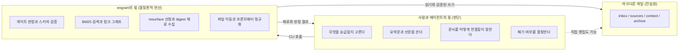

점선이 중요하다. 사용자는 언제든 에디터로 파일을 직접 고칠 수 있다. engram은 파일 접근을 독점하지 않으며, 독점하려 들면 마크다운이 진실원이라는 전제가 깨진다. 직접 편집한 결과는 다음 `lint` 또는 `status`에서 검증된다.

## 2. 호출 방향

가장 자주 오해가 생기는 지점이다. engram은 LLM을 부르지 않는다. 이미 열려 있는 에이전트 세션이 engram을 부른다.

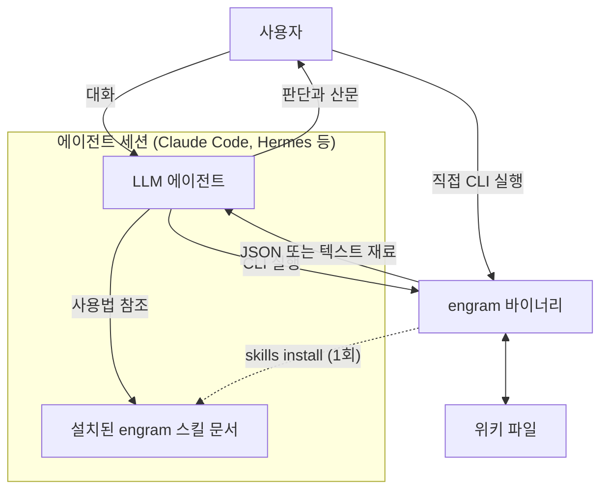

`skills install`은 바이너리에 임베드된 스킬 문서를 에이전트의 스킬 디렉토리에 복사하는 일회성 설치다. 실행 시점의 호출이 아니다.

이 구조에서 engram은 자격증명을 보관하지 않는다. API key도, OAuth 토큰도, 프로바이더 설정도 없다. 인증은 전적으로 에이전트 쪽 문제다. 근거는 ADR 0014에 있다.

## 3. 승급 파이프라인

이 프로젝트의 유일한 차별점이다. 다른 PKM 도구에는 게이트가 없다.

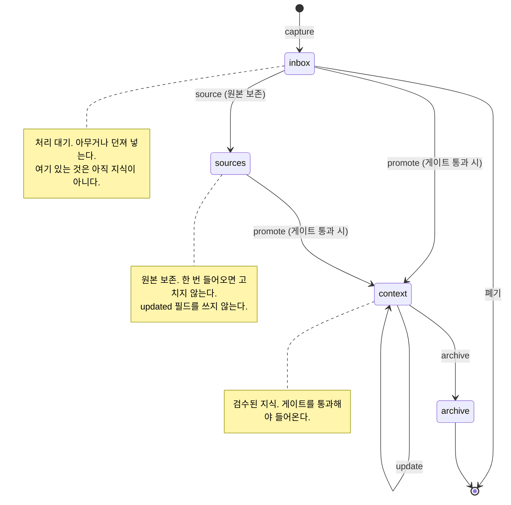

`archive`에서 나가는 화살표가 없다는 점이 설계다. 폐기는 삭제가 아니라 이동이며, 되돌리려면 사람이 명시적으로 다시 승급해야 한다.

## 4. 승급 게이트의 판정 흐름

`promote` 한 번이 실제로 어떤 순서로 진행되는지다. 거절 사유와 경고를 구분하는 것이 핵심이다.

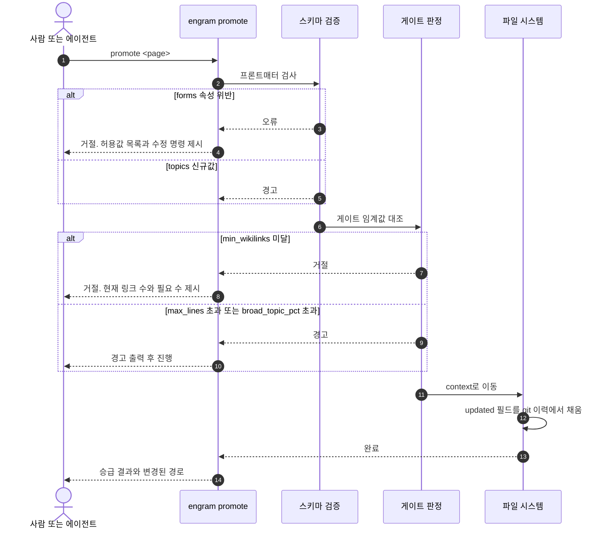

거절 사유는 `min_wikilinks` 하나뿐이고 나머지는 경고다. 거절 조건을 늘리면 사용자가 게이트를 우회할 방법을 찾기 시작하며, 그 순간 게이트가 무의미해진다. 근거는 ADR 0009에 있다.

## 5. 검색과 회수

검색 계층은 코어와 선택 층으로 나뉜다. 선택 층이 없어도 기능이 사라지지 않고 성능만 떨어져야 한다.

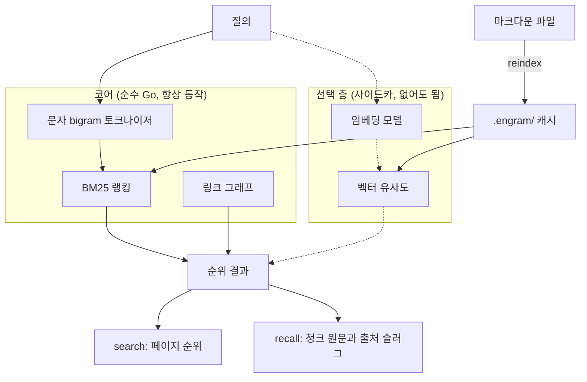

`search`와 `recall`의 차이가 ADR 0014의 원칙을 그대로 보여준다. `search`는 사람이 읽을 페이지 목록을 주고, `recall`은 에이전트가 컨텍스트에 넣고 인용할 청크 원문을 준다. **둘 다 요약을 반환하지 않는다.** 요약은 에이전트의 몫이다.

라틴 문자와 숫자 구간은 bigram으로 쪼개지 않는다. `min_wikilinks` 같은 식별자가 조각나면 검색이 붕괴한다. 근거는 ADR 0010에 있다.

## 6. 재발견 루프

위키가 커질수록 가치가 나오는 부분이며, 동시에 사람이 손으로는 절대 못 하는 부분이다.

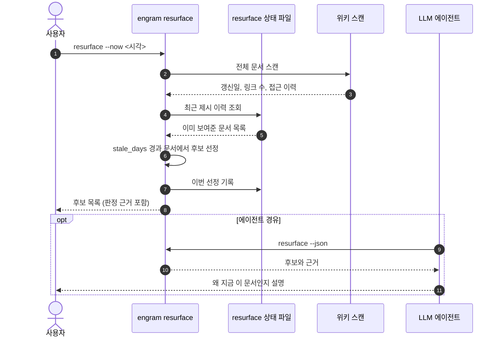

`--now` 플래그가 처음부터 있어야 한다. 상태 파일 때문에 실행 시각에 따라 결과가 달라지므로, 이것이 없으면 harness 골든 비교가 성립하지 않는다. 나중에 넣으면 그 전까지의 동등성 검증 수치가 전부 무의미해진다. 근거는 ADR 0005에 있다.

### bridge의 두 축

`resurface`가 시간을 보는 것과 달리 `bridge`는 관계를 본다. 축이 둘이고 서로 다른 것을 잡는다.

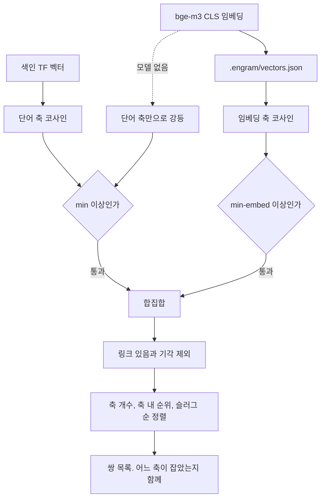

**하한이 둘인 이유는 두 코사인의 눈금이 다르기 때문이다.** 무관한 한국어 문서 쌍도 임베딩 코사인이 0.5 안팎으로 나오는 반면 단어 코사인은 훨씬 낮다. 하한 하나를 두 축에 걸면 한쪽이 전부 통과하거나 전부 탈락한다.

**교집합이 아니라 합집합인 이유는 두 축이 다른 것을 잡기 때문이다.** 단어 축은 주제가 달라도 한쪽이 다른 쪽을 본문에서 언급하면 잡고, 임베딩 축은 공통 낱말이 없어도 같은 이야기를 하면 잡는다. 교집합을 보면 둘 다 잡는 좁은 영역만 남아 재발견이 죽는다.

**임베딩 계산은 `bridge`가 필요할 때만 한다.** 문서당 12.6초라 `reindex`에 넣으면 편집마다 그 비용을 문다. 캐시 키는 잘라낸 본문의 내용 해시이므로 형식만 바뀐 커밋으로 다시 계산하지 않는다. 근거는 ADR 0074와 0075에 있다.

**그 캐시를 읽는 자리가 셋 더 있다.** `search --semantic`, `serve`의 `/resurface` 화면, MCP의 `search` 도구다. 셋 다 읽기만 하고 계산하지 않는다. 캐시가 비어 있으면 `search --semantic`은 `bridge`를 안내하고 멈추며 나머지 둘은 단어 축만으로 돈다.

`search --semantic`만 예외로 벡터를 하나 더 만든다. **질의다.** 문서 하나가 12.6초인 것과 달리 질의는 모델 적재까지 1초 안쪽이라 조회 안에서 감당한다. 밀어 넣는 글자 수가 다르기 때문이다. 대상은 `context/`뿐인데 벡터를 만드는 자리가 `bridge`이고 `bridge`가 `context/`만 보기 때문이다. 근거는 ADR 0078에 있다.

## 7. easy 모드와 eject 이후

eject는 제품에서 나가는 문이 아니라 **규칙의 소유권을 넘기는 동작**이다. 연산은 그대로 남는다.

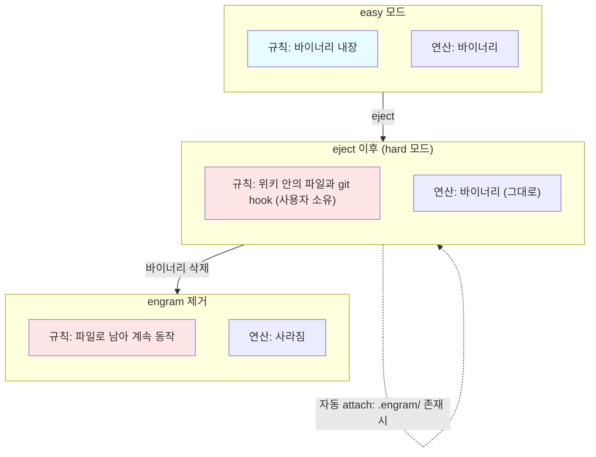

색이 바뀌는 행은 규칙뿐이고 연산 행은 easy와 hard가 동일하다. 이것이 eject를 단방향으로 두어도 안전한 이유다. 되돌릴 대상 자체가 없으므로 `seal`은 폐기했다. 근거는 ADR 0013에 있다.

`attach`는 별도 커맨드가 아니라 기본 동작이다. 위키 루트에 `.engram/`이 있으면 자동으로 붙는다. 원치 않으면 그 디렉토리를 지우면 되고, 강제는 없다.

## 8. eject 이후의 역할 분담

eject한 사용자의 실제 하루다. 두 흐름이 서로를 호출하지 않는다는 점이 핵심이다.

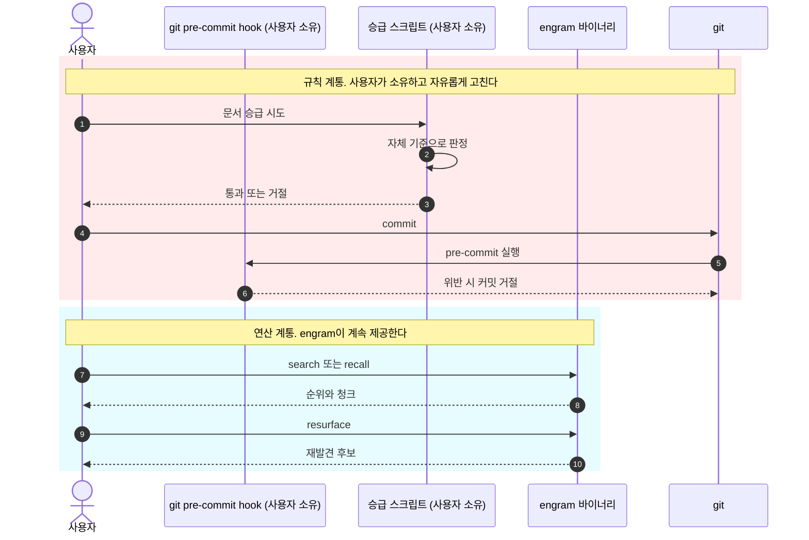

붉은 영역과 푸른 영역 사이에 화살표가 없다. 이 독립성 때문에 사용자가 규칙 스크립트를 어떻게 고쳐도 검색과 재발견이 망가지지 않는다.

## 9. upstream 동기화

engram은 운영 중인 위키 체계를 특정 시점에 얼려 출판한 산물이다. 원본과 어긋나지 않았음을 증명하는 장치가 harness다.

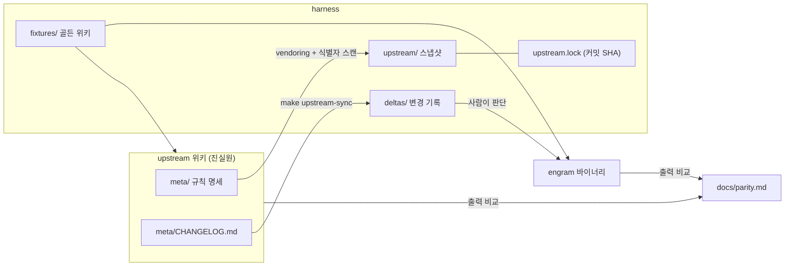

자동 반영이 없다는 점이 설계다. 변경분은 사람이 읽고 반영 여부를 판단한다. 비교 축은 lint 위반 목록, resurface 선정 순위, 프론트매터 정규화 결과, eject 산출물 diff 넷이다. 넷 다 결정론적이라 골든 비교가 성립한다. LLM 호출이 바이너리에 없으므로 예외 구멍을 뚫을 필요가 없다.

## 10. 전체 데이터 흐름

지금까지의 조각을 하나로 합친 그림이다.

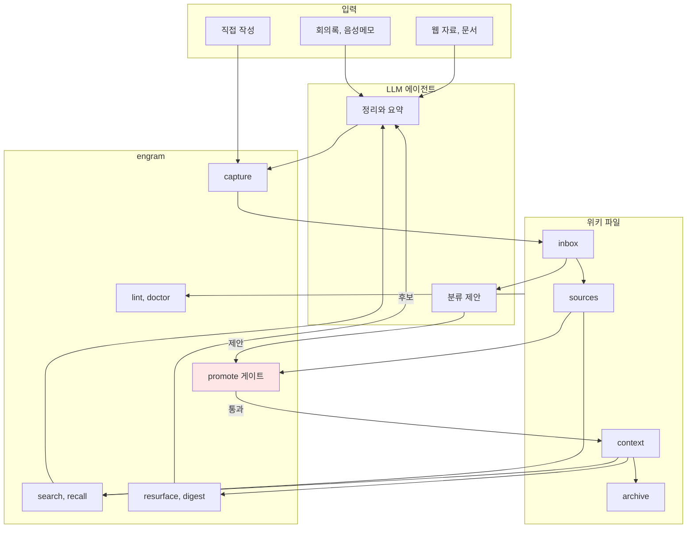

붉게 칠한 게이트가 유일한 관문이다. 에이전트는 `inbox`까지만 쓸 수 있고, `context`로 올라가려면 반드시 게이트를 지난다. MCP로 위키를 노출하더라도 이 경계는 동일하다. 에이전트가 `context`에 직접 쓸 수 있게 되는 순간 승급 파이프라인이라는 차별점 자체가 사라진다.

## 11. 밖으로 나가는 세 경로

1.0에서 위키를 밖으로 내는 커맨드가 셋이 되었다. `mcp`, `serve`, `export`다. 셋의 차이는 **누구에게 나가는가**이고, 그 차이가 노출 판정을 거치는지를 가른다.

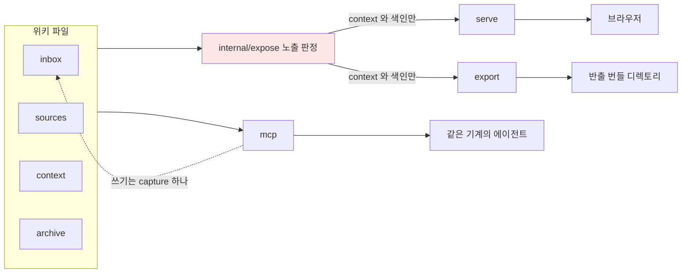

**`mcp`는 노출 판정을 거치지 않는다.** stdio로 붙는 로컬 프로세스이고 상대가 사용자 자신의 에이전트이기 때문이다. 사용자가 에디터로 열 수 있는 파일을 자기 에이전트에게 감출 이유가 없다. 대신 다른 쪽을 조인다. 쓰기 도구가 `capture` 하나이고 `promote`를 내보내지 않는다(ADR 0043).

**`serve`와 `export`는 같은 판정을 부른다.** 네트워크에 뜨거나 파일로 나가서 **남에게 도달**하기 때문이다. `context`와 색인 문서만 나가고 `inbox`와 `sources`는 목록에도 없다. `sensitivity` 축이 켜진 위키에서는 `private-local-only`와 `restricted`가 빠지며 이 제외를 뒤집는 플래그는 없다(ADR 0044).

붉게 칠한 판정이 한 곳인 것이 요점이다. 두 벌로 두면 `serve`가 감추는 문서를 `export`가 내보내는 상태가 생기고, 그 순간 민감도 선언은 도구가 지키지 않는 장식이 된다(ADR 0046). 게이트를 단일 함수로 유지하는 이유와 같다.

`export`는 여기에 익명화를 하나 더 얹는다. 사용자가 준 치환 사전을 본문과 프론트매터와 파일명 전부에 적용한다. **사전은 내장하지 않는다.** 조직 어휘 목록은 공개 경계 밖이므로 메커니즘만 주고 사전은 쓰는 사람이 채운다(ADR 0024, 0047).

## 관련

- [ADR 색인](decisions/README.md)
- [0009 스키마 프리셋과 게이트 임계값](decisions/0009-schema-presets-and-thresholds.md)
- [0010 저장, 인덱스, 한국어 검색](decisions/0010-storage-index-and-korean-search.md)
- [0013 eject 재정의와 seal 폐기](decisions/0013-eject-redefined-seal-removed.md)
- [0014 LLM과 engram의 역할 경계](decisions/0014-llm-boundary-agent-drives-binary.md)
