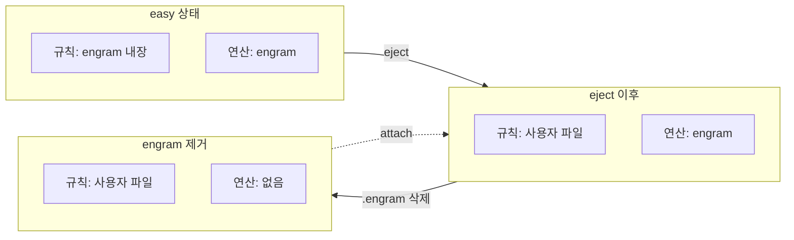
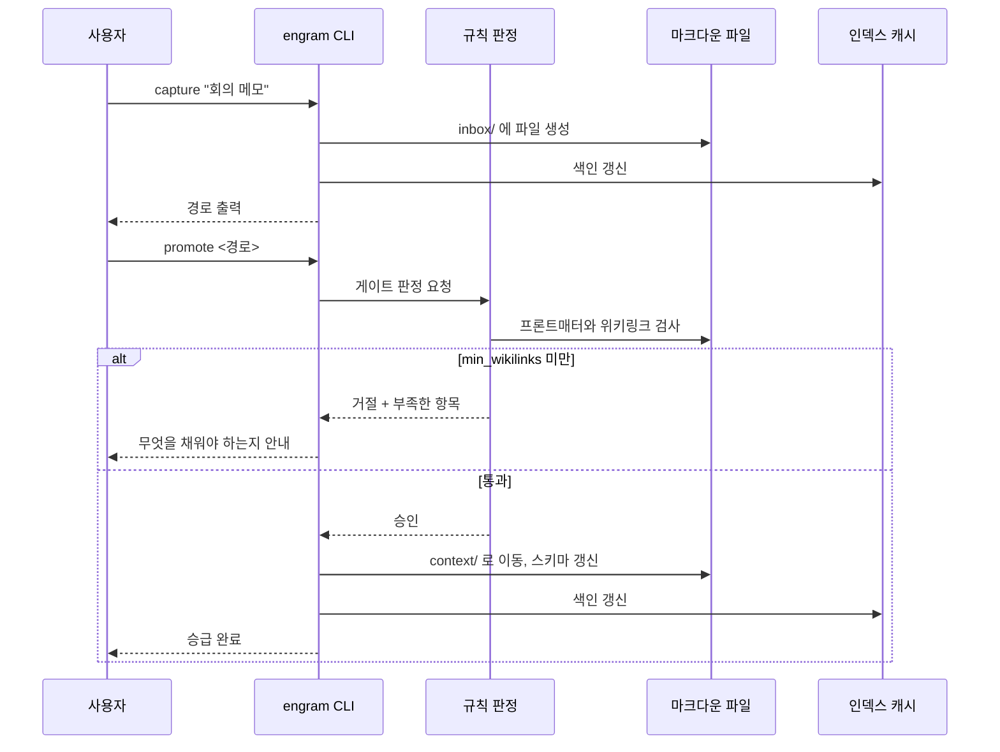
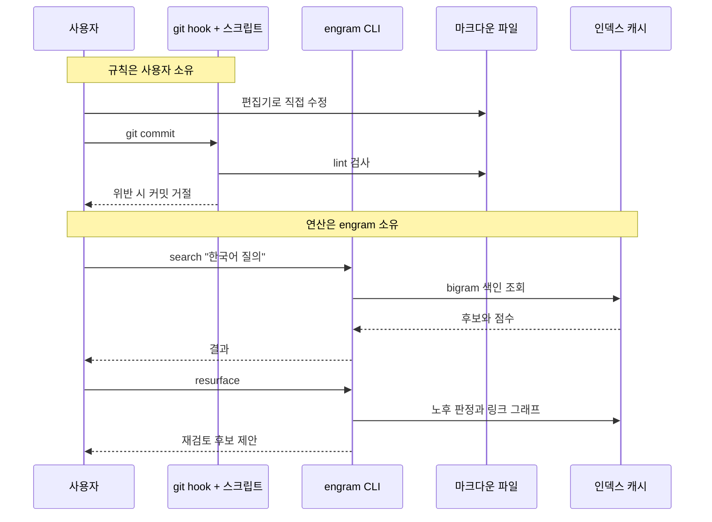

# eject를 규칙 소유권 이양으로 재정의하고 seal을 폐기한다

## 배경

ADR 0006은 easy mode와 hard mode를 "하나의 성장 경로"로 정의하고 세 커맨드를 두었다. `eject`(easy에서 hard로), `seal`(hard에서 easy로 되돌리기, 파괴적), `attach`(기존 hard 위키에 바이너리를 붙이기, 후순위)다.

이 정의는 설계 논의에서 반복적으로 혼선을 일으켰다. eject한 사용자가 제품을 떠나는 것인지, `seal`로 돌아올 수 있어야 하는지, 돌아오는 것이 무슨 의미인지가 매번 다시 논의되었다. 구현 부담도 크다. `seal`이 성립하려면 eject 원본과의 drift 감지, diff 표시, 부분 수정 병합, 그 사이 스키마 변경 처리가 모두 필요하다.

## 판단 근거

**혼선의 원인은 모드를 통째로 하나의 축에 올려놓은 것이다.** engram의 기능은 성격이 다른 두 종류다.

| 종류 | 예 | 파일로 내보낼 수 있는가 |
|---|---|---|
| 규칙 강제 | 승급 게이트, lint, 스키마 검증, git hook | 가능. 스크립트와 계약 문서로 표현된다 |
| 연산 | 키워드 검색, 재발견 루프, 링크 그래프, 다이제스트 | 불가능. Go로 구현된 엔진이다 |

`eject`는 첫 번째 줄만 내보낸다. 두 번째 줄은 내보낼 수 없다. 그런데 ADR 0006은 eject를 "모드 전환"으로 정의했기 때문에, eject한 사용자가 연산까지 잃는 것처럼 읽힌다. 이것이 진짜 결함이며, 사용자를 잃는 문제가 아니라 **사용자가 제품에서 가장 만들기 어려운 부분을 잃는 문제**다.

**연산은 upstream에서도 미해결이다.** upstream llm-wiki는 외부 검색 엔진 도입을 계획했다가 한국어 문서 검색이 제대로 동작하지 않아 철회했다. 즉 규칙은 스크립트로 충분히 굴러가지만 검색과 재발견은 그렇지 않다. eject한 사용자가 잃는 것이 정확히 그 부분이다.

**따라서 두 축을 분리하면 seal이 불필요해진다.** eject를 "규칙의 소유권을 사용자에게 넘기는 행위"로 정의하면, 연산은 넘어가지 않고 제품에 남는다. 사용자는 제품을 떠난 적이 없으므로 돌아올 필요도 없다. `seal`은 되돌릴 대상 자체가 사라진다.

**seal은 정직하게 구현하면 "당신의 수정을 지웁니다"가 된다.** eject 후 사용자가 규칙 파일을 고치지 않을 것이라면 eject할 이유가 없었다. 고쳤다면 seal은 그 작업을 버려야 한다. create-react-app이 eject를 단방향으로 고정하고도 문제가 없었던 선례가 이를 뒷받침한다. ADR 0006도 이 선례를 알면서 seal을 두었는데, 그것은 eject의 대칭어를 찾는 과정에서 나온 이름 주도 결정이었다.

**attach는 모드 전환이 아니라 관심사 분리의 결과다.** 규칙은 사용자 소유, 연산은 제품 소유인 상태가 정상 상태다. 작성자 본인의 위키가 이미 그 형태다. 규칙은 직접 굴리고 검색 도구는 따로 찾고 있었다. attach는 그 빈자리에 engram이 들어가는 것이다.

## 결정

### eject 재정의

`eject`는 **규칙의 소유권을 사용자에게 넘기는 행위**다. 제품에서 나가는 문이 아니다.

- 내보내는 것: `AGENTS.md`, `meta/` 규칙 문서, lint 스크립트, `.githooks/pre-commit`, `.gitattributes`
- 내보내지 않는 것: 검색 인덱스, 재발견 루프, 링크 그래프, 다이제스트. 이들은 계속 engram이 수행한다
- **eject 이후에도 `search`, `resurface`, `digest`, `backlinks`는 동작한다**
- 단방향이다. 되돌리는 커맨드를 제공하지 않는다

### seal 폐기

`seal`을 폐기한다. ADR 0006에서 정의된 이 커맨드는 구현하지 않는다.

`pack`은 배포 번들 용도로 예약된 상태를 유지한다(여정 14, 15). seal 폐기가 pack에 영향을 주지 않는다.

### attach의 위치

`attach`는 후순위가 아니다. 두 경로로 성립한다.

- **암묵적 attach**: 위키 루트에 `.engram/`이 있으면 engram이 자동으로 붙는다. eject해도 이 디렉토리는 남으므로 연산이 끊기지 않는다. 사용자가 완전히 독자적으로 가고 싶으면 `.engram/`을 지우면 된다. 강제가 없다
- **명시적 `attach`**: 처음부터 hard로 시작한 외부 위키를 인식할 때 사용한다. `.engram/`을 만들고 인덱스를 구축한다. 위키 파일은 손대지 않는다

마일스톤은 0.2에서 0.3 사이로 앞당긴다. ADR 0006은 이를 후순위로 두었으나, 작성자 본인의 실사용 경로이자 upstream과의 parity 검증 경로이므로 미룰 수 없다.

### rules show 신설

내장 규칙을 읽기 전용으로 출력하는 `rules show`를 둔다. eject 없이 규칙을 확인하려는 경우를 위한 것이며, 커리큘럼에서 화이트박스화의 역할을 맡는다.

교육 서사의 마지막 단계는 "도구를 버리는 법"이 아니라 "규칙은 당신 것이 되고 어려운 계산은 도구가 계속 해준다"가 된다.

## 동작 구조

### 소유권 축

eject는 규칙 행만 바꾼다. 연산 행은 그대로다. 연산을 잃는 것은 `.engram/`을 지웠을 때뿐이며, 그때도 `attach`로 되돌아올 수 있다. 되돌아오는 경로가 있는 쪽은 seal이 아니라 attach다.

### 승급 파이프라인 호출 흐름

`규칙 판정`이 easy에서는 engram 내장 로직이고 eject 이후에는 사용자 소유의 스크립트와 git hook이다. 호출하는 쪽과 판정하는 쪽의 경계가 같으므로 eject가 나머지 흐름을 건드리지 않는다.

### eject 이후의 역할 분담

두 흐름이 서로를 호출하지 않는다. 이 독립성이 eject를 단방향으로 두어도 안전한 이유다.

## 결과

- ADR 0006의 커맨드 체계를 개정한다. `eject`는 유지하되 정의가 바뀌고, `seal`은 폐기하며, `attach`는 승격된다.
- 여정 16(eject와 hard mode 전환)이 커리큘럼의 클라이맥스에서 부록으로 내려간다. 클라이맥스는 `rules show`가 맡는다.
- 여정 19(되돌리기)에서 "seal 실행 취소" 항목이 사라진다. 잘못된 승급 강등과 migrate 오적용 복구만 남는다.
- ADR 0005의 parity 검증이 쉬워진다. attach로 upstream 위키에 직접 붙여 Go 구현과 upstream 스크립트의 출력을 같은 데이터에서 비교할 수 있다.
- `.engram/` 디렉토리가 attach 여부를 결정하는 표식이 된다. ADR 0010이 이를 인덱스 캐시 위치로 정했으므로 역할이 하나 더 붙는다.

## 열린 항목

- eject가 내보낸 규칙 파일이 이후 engram 버전과 어긋날 때의 처리. `doctor`가 drift를 경고하는 선까지만 하고 자동 갱신은 하지 않는다는 방향이나, 경고 판정 기준은 정하지 않았다.
- `attach`가 인식할 수 있는 외부 위키의 최소 조건. upstream llm-wiki는 확실히 대상이지만, 임의의 마크다운 폴더를 어디까지 수용할지 정하지 않았다.
