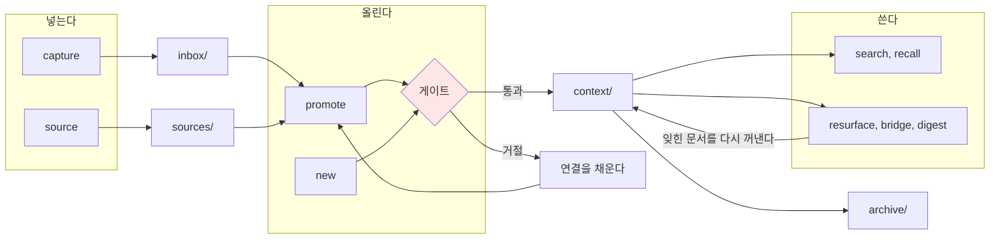

# engram

[English](../../README.md) | 한국어

[](https://github.com/neocode24/engram/actions/workflows/ci.yml)
[](../../go.mod)
[](../../LICENSE)

engram은 마크다운 위키에 "승급" 단계를 두는 CLI입니다. 메모는 `inbox`에 자유롭게 넣고, 원본은 `sources`에 보관하고, 정리가 끝난 지식만 `context`로 올립니다. 이 마지막 단계에서 engram이 문서가 다른 문서와 연결되어 있는지 확인하고, 연결이 없으면 승급을 거절합니다. 메모는 계속 쌓이는데 정작 나중에 찾아 쓸 수 있는 지식은 늘지 않는 문제를 겪고 있다면, 이 게이트 하나가 그 차이를 만듭니다.


지식은 대화창이나 모델 안이 아니라 내가 소유한 마크다운 파일에 둡니다. LLM은 그 공간을 정리하고 제안하는 일꾼이고, 기억 자체는 파일이 맡습니다. 그래서 그 파일들은 대충 쌓아 두는 곳이 아니라 스키마와 단계와 이력이 있고 들어올 자격이 있는 자산이어야 하는데, engram은 그 관리를 사람의 의지가 아니라 코드로 지킵니다. 이 문서에서 second brain이라는 말은 이런 뜻으로 씁니다.

> engram은 기억이 뇌에 남기는 물리적 흔적을 뜻하는 말입니다. 흔적은 저장이 아니라 연결로 남습니다. 이 도구가 연결을 요구하는 이유이기도 합니다.

## 무엇이 다른가요

대부분의 노트 도구는 넣기는 쉽지만 꺼내 쓰기는 어렵습니다. 몇 달 지나면 서로 연결되지 않은 메모가 잔뜩 남고, 검색해도 원하는 것이 나오지 않습니다.

engram은 문서가 `context/`로 올라가는 순간에만 한 가지를 요구합니다. 다른 문서로 가는 링크가 두 개 이상 있을 것.

```
$ engram promote inbox/2026-08-16-llm-게이트웨이-조사.md --type concept
Error: 승급 게이트를 넘지 못했습니다: 위키링크가 0개로 min_wikilinks 2개에 못 미칩니다
related 필드나 본문에 위키링크를 2개 더 추가하세요.
이 자리에서 채우려면 --related <슬러그>를 반복해 주세요
```

거절 사유는 이것 하나뿐입니다. 길이나 형식, 태그는 검사하지 않습니다. 요구가 많아지면 사람들은 게이트를 피해 가기 시작하기 때문입니다. 검색이나 재발견, 웹 뷰어는 다른 도구에도 있지만, 승급을 코드로 막고 여는 이 게이트가 engram이 다른 점입니다.

### 성숙 단계


1 inbox, 2 sources, 3 context, 4 archive. 게이트는 3 앞에 있습니다.

디렉토리는 주제별 분류함이 아니라 문서가 얼마나 다듬어졌는지를 나타내는 단계입니다. 아래로 갈수록 검증된 지식입니다.

| 디렉토리 | 단계 | 성격 | 검사 |
|---|---|---|---|
| `inbox/` | 러프 캡처 | 임시 보관. 처리되면 비워집니다 | 없음 |
| `sources/` | 원본 보존 | 추가만 하고 본문은 고치지 않습니다 | 스키마 |
| `context/` | 정리된 지식 | 다시 꺼내 쓸 수 있는 결론 | 스키마 + 게이트 |
| `archive/` | 수명 종료 | 이력으로만 남습니다. 링크는 깨지지 않습니다 | 스키마 |

`sources/`의 문서에는 `updated` 필드를 쓰지 않습니다. 오타 하나 고친 것 때문에 원본이 최근 자료처럼 보이면 안 되기 때문입니다.

문서마다 YAML 프론트매터로 상태를 갖습니다.

```yaml
---
type: concept
artifact_stage: context
status: promoted
topics: [llm, gateway]
form: note
derived_from:
  - sources/2026-08-게이트웨이-벤치마크.md
related:
  - "[[index]]"
indexable: true
---
```

## 설치

```sh
go install github.com/neocode24/engram/cmd/engram@latest
```

순수 Go로 만들었고 CGO를 쓰지 않아서 런타임 의존성이 없습니다. Go가 지원하는 플랫폼이면 어디서든 빌드됩니다.

소스에서 직접 빌드할 수도 있습니다.

```sh
git clone https://github.com/neocode24/engram.git
cd engram
go build ./cmd/engram
```

## 5분 만에 해 보기

빈 디렉토리에서 시작해 첫 승급까지 갑니다. 아래 출력은 전부 실제 실행 결과입니다.

### 위키를 만듭니다

```
$ engram init wiki
위키를 초기화했습니다: wiki (프리셋: education)

디렉토리:
  inbox/       새 자료가 들어오는 곳
  sources/     원본을 보존하는 곳
  context/     정리된 문서가 사는 곳
  archive/     승급에서 물러난 문서가 가는 곳

파일:
  engram.yaml  위키 설정. 축과 임계값을 여기서 조정하세요
  index.md     첫 문서. 위키 소개로 채우세요
  .gitignore   .engram/ 캐시 디렉토리를 git에서 제외합니다

다음 단계:
  1. inbox에 첫 자료를 넣으세요
  2. engram.yaml을 열어 축과 임계값을 위키에 맞게 조정하세요
  3. index.md를 위키 소개로 채우세요
```

### 일단 받습니다

```
$ engram capture --title "LLM 게이트웨이 조사" "여러 프로바이더를 한 엔드포인트로 묶는 패턴. 회의에서 나온 조사 과제."
inbox에 넣었습니다: inbox/2026-08-16-llm-게이트웨이-조사.md
다음: 문서를 정리한 뒤 승급하세요. 지금은 engram lint로 위키 상태를 볼 수 있습니다
```

`capture`는 아무것도 검사하지 않습니다. 회의 중에 치는 명령이라 걸리는 것이 있으면 안 됩니다.

### 원본은 따로 보관합니다

```
$ engram source --title "게이트웨이 벤치마크" --created 2026-08 --ref "https://example.com/report" "지연시간과 비용을 프로바이더별로 측정한 원문."
source에 넣었습니다: sources/2026-08-게이트웨이-벤치마크.md
다음: 정리가 끝나면 이 원본을 인용하는 맥락 문서를 만드세요
```

### 승급합니다. 처음에는 거절당합니다

```
$ engram promote inbox/2026-08-16-llm-게이트웨이-조사.md --type concept
Error: 승급 게이트를 넘지 못했습니다: 위키링크가 0개로 min_wikilinks 2개에 못 미칩니다
related 필드나 본문에 위키링크를 2개 더 추가하세요.
이 자리에서 채우려면 --related <슬러그>를 반복해 주세요
```

연결을 채워서 다시 시도하면 통과합니다.

```
$ engram promote inbox/2026-08-16-llm-게이트웨이-조사.md --type concept \
    --related index --related 2026-08-게이트웨이-벤치마크
context로 올렸습니다: context/llm-게이트웨이-조사.md
문서 종류: concept
게이트: 링크 2개, 대상 2개, 기준 2개
다음: engram lint로 승급 문서의 스키마를 확인하세요
```

### 확인합니다

```
$ engram lint
검사한 파일 3개, 위반 없음

$ engram status
현황
  inbox 0, source 1, context 1, archive 0 문서
  위키링크 2개, 고아 문서 0개
  lint: 파일 3개, error 0, warn 0, reject 0 (상세는 engram lint)

적체 압력 (기준 2026-08-16)
  inbox 문서 0개
  지금 승급할 수 있는 문서 0개

다음 행동
  - engram capture
    inbox가 비었습니다. 새 메모를 받아 파이프라인을 돌리세요
```

### 쌓인 위키를 다시 꺼냅니다

위키가 커지면 검색과 재발견이 힘을 냅니다. `reindex`로 색인을 만들고 나면 `search`가 문서 목록을, `recall`이 인용할 수 있는 원문 조각을 돌려줍니다.

```
$ engram reindex
색인을 만들었습니다: .engram/index.json
문서 3개, 토큰 76개, 크기 3832 바이트

$ engram search 게이트웨이
  1  2.73  2026-08-게이트웨이-벤치마크  sources/2026-08-게이트웨이-벤치마크.md
  2  2.66  llm-게이트웨이-조사  context/llm-게이트웨이-조사.md

$ engram recall 게이트웨이 --limit 1
1  4.00  [[2026-08-게이트웨이-벤치마크]]  sources/2026-08-게이트웨이-벤치마크.md:16-18
# 게이트웨이 벤치마크

지연시간과 비용을 프로바이더별로 측정한 원문.
```

재발견 커맨드는 후보와 근거만 돌려줍니다. `resurface`는 `stale_days`가 지난 문서를, `bridge`는 내용이 비슷한데 링크가 없는 문서 쌍을, `digest`는 기간 안의 변화를 꺼내 줍니다. 수명이 끝난 문서는 `archive`로 옮깁니다. 슬러그가 그대로 유지되므로 그 문서를 가리키던 링크는 깨지지 않습니다.

## 에이전트와 함께 쓰기

engram은 LLM을 직접 부르지 않습니다. API 키나 OAuth 토큰, 프로바이더 설정을 보관하지 않고, 대신 이미 열려 있는 에이전트 세션(Claude Code, Hermes 등)이 engram을 부릅니다. 연결은 `engram skills install` 한 번이면 됩니다. 바이너리에 들어 있는 스킬 문서를 에이전트의 스킬 디렉토리에 심어 주는 것이 LLM 통합의 전부입니다.

역할은 이렇게 나뉩니다.

| 하는 일 | 맡는 쪽 |
|---|---|
| 게이트 판정, lint, 스키마 검사 | engram |
| 검색, 링크 그래프, 재발견 후보 뽑기 | engram |
| 회의록 요약, 분류 제안, 다이제스트 문장 | 에이전트 |

기준은 하나입니다. 같은 입력에 같은 출력이 나오는 일은 engram이 하고, 판단이 필요한 일은 사람이나 에이전트가 합니다. 그래서 조회 커맨드는 완성된 문장이 아니라 재료를 돌려주고, 모든 조회 커맨드에 `--json`이 있습니다. 에이전트가 위키에 쓸 수 있는 곳은 `inbox/`까지이고, `context/`로 올리는 일은 사람이 게이트를 지나서 합니다.

MCP로 노출할 때도 같은 경계를 지킵니다. `engram mcp`가 내보내는 도구 열 개 중 쓰기는 `capture` 하나이고 `inbox`에만 씁니다. `promote`는 도구로 내보내지 않습니다. 에이전트에게 승급을 실행할 수단이 없어야 게이트가 게이트로 남습니다.

웹으로 공유할 때는 한 층 더 좁습니다. `engram serve`는 읽기 전용이고 `context/`에 올라간 문서만 보여 줍니다. `inbox/`와 `sources/`는 목록에도 URL에도 나오지 않습니다. 팀에 보이려면 승급해야 합니다.

## 커맨드

스물여덟 개이고 다섯 갈래로 나뉩니다. 넣고, 올리고, 조회하고, 다시 꺼내고, 관리합니다.



### 넣기

| 커맨드 | 하는 일 |
|---|---|
| `capture` | 검사 없이 `inbox/`에 받습니다 |
| `source` | `sources/`에 원본을 확정합니다. 출처와 작성일을 남깁니다 |

### 올리기

| 커맨드 | 하는 일 |
|---|---|
| `promote` | 기존 문서를 `context/`로 올립니다. 게이트를 지납니다 |
| `new` | 처음부터 정리된 지식으로 `context/`에 씁니다. 게이트를 지납니다 |
| `demote` | 잘못 올린 문서를 `inbox/`나 `sources/`로 되돌립니다 |
| `archive` | 수명이 끝난 문서를 `archive/`로 옮깁니다. 슬러그가 유지되어 링크가 깨지지 않습니다 |

### 조회

| 커맨드 | 하는 일 |
|---|---|
| `search` | 위키를 검색합니다. 사람이 열어 볼 문서 목록입니다 |
| `recall` | 질의에 맞는 원문 조각을 출처와 함께 돌려줍니다. 에이전트가 인용할 재료입니다 |
| `backlinks` | 슬러그를 가리키는 링크를 종류별로 보여 줍니다 |
| `lint` | 스키마와 링크 무결성을 검사합니다 |
| `status` | 현황과 inbox 적체, 다음에 할 일을 보여 줍니다 |
| `doctor` | 환경과 위키 설정을 진단하고 항목마다 고치는 법을 알려 줍니다 |

### 재발견

| 커맨드 | 하는 일 |
|---|---|
| `resurface` | 오래 안 본 `context/` 문서를 다시 꺼냅니다. 보여 준 이력을 남깁니다 |
| `bridge` | 비슷한데 링크가 없는 문서 쌍을 찾습니다. 기각한 쌍은 다시 묻지 않습니다 |
| `digest` | 기간 안의 신규, 승급, 노후, 고아 문서를 집계합니다 |

### 관리

| 커맨드 | 하는 일 |
|---|---|
| `init` | 새 위키를 만듭니다. 프리셋 3종 |
| `mv` | 문서 슬러그를 바꾸고 걸린 링크를 모두 고칩니다 |
| `update` | 문서의 프론트매터와 본문을 갱신합니다 |
| `reindex` | 검색 색인을 만듭니다. 색인을 쓰는 유일한 커맨드입니다 |
| `migrate` | 기존 문서를 지금 설정과 규칙에 맞춥니다. `--dry-run`이 기본입니다 |
| `sync` | git 이력에서 `updated`와 `sourced_at`을 바로잡습니다. `--dry-run`이 기본입니다 |
| `rules show` | 이 위키에 적용되는 규칙 전부를 읽기 전용으로 보여 줍니다 |
| `eject` | 규칙을 명세 문서와 Python 린터로 풀어 사용자에게 넘깁니다. 되돌리는 커맨드는 없습니다 |
| `skills install` | 에이전트에 스킬 문서를 심습니다 |
| `mcp` | 위키를 MCP 서버로 노출합니다. 쓰기 도구는 `capture` 하나입니다 |
| `serve` | 읽기 전용 웹 뷰어입니다. `context/`만 보여 줍니다 |
| `export` | 문서를 반출합니다. 노출 규칙은 `serve`와 같고, 사용자가 준 사전으로 익명화합니다 |
| `version` | 버전과 빌드 정보 |

전역 플래그는 둘입니다. `--json`은 기계가 읽는 출력이고, `--now`는 기준 시각을 고정해서 같은 입력에 늘 같은 결과가 나오게 합니다.

`promote`는 출발지에 따라 동작이 다릅니다. `inbox/` 문서는 옮기고, `sources/` 문서는 원본을 그대로 둔 채 파생 문서를 만듭니다. 원본 보관 계층에서 문서를 빼내면 보관이라는 약속이 깨지기 때문입니다. 파생 관계는 `derived_from`과 `derived_context`로 양쪽에 기록됩니다.

`search`와 `recall`은 일부러 나눠 두었습니다. `search`는 사람이 열어 볼 목록을 주고, `recall`은 에이전트가 컨텍스트에 넣고 `[[슬러그]]`로 인용할 원문 조각을 줍니다. 둘 다 요약은 하지 않습니다.

## 설정

위키 루트의 `engram.yaml` 하나입니다. git에 커밋해서 팀이 같은 규칙을 씁니다.

```yaml
preset: education

# taxonomy. topics는 개방 집합이고 forms는 폐쇄 집합이다.
topics: [llm, gateway]
forms: [note, report]

# 임계값. min_wikilinks만 승급 거절 사유이고 나머지는 경고에 쓰인다.
min_wikilinks: 2    # promote 게이트. 0으로 두면 게이트가 꺼진다
stale_days: 90      # 재발견 대상 판정 기준 일수
max_lines: 1000     # 문서 길이 경고 상한
broad_topic_pct: 25 # 광범위 주제 비율 경고 상한(퍼센트)
```

프리셋은 스키마 축을 몇 개 켤지 정합니다. `personal`이 `education`에 포함되고 `education`이 `team`에 포함되며, 기본값은 `education`입니다.

| 프리셋 | 이럴 때 |
|---|---|
| `personal` | 혼자 쓰는 위키. 축이 가장 적습니다 |
| `education` | 입력 경로와 승급 이력을 남기고 싶을 때 |
| `team` | 업무 자료와 개인 자료가 섞일 때. 민감도 축이 켜집니다 |

포함 관계를 지키기 때문에 프리셋을 올릴 때는 필드만 추가하면 됩니다.

`topics`는 열려 있고 `forms`는 닫혀 있습니다. lint는 `forms`에 없는 값을 오류로, `topics`에 없는 값을 경고로 다룹니다. 이 구분이 없으면 오타로 생긴 분류가 조용히 자리를 잡습니다.

## 어디까지 왔나요

0.1부터 1.0까지 끝났습니다. 위 커맨드 스물여덟 개는 전부 동작합니다. 첫 릴리스는 저장소 공개와 함께 나갑니다.

| 마일스톤 | 범위 | 상태 |
|---|---|---|
| 0.1 | `init`, `capture`, `source`, `promote`, `new`, 게이트, `lint`, `status`, `doctor` | 완료 |
| 0.2 | `search`, `backlinks`, `reindex`, `demote`, `mv`, `update` | 완료 |
| 0.3 | `resurface`, `bridge`, `digest`, `recall`, `archive` | 완료 |
| 0.4 | `eject`, `rules show`, `migrate`, `sync` | 완료 |
| 1.0 | `skills install`, MCP 노출, `serve`, `export`, 릴리스 배포 | 완료 |

`eject`는 규칙을 사용자에게 넘기지만 연산은 넘기지 않습니다. 내보낸 뒤에도 `search`, `recall`, `resurface`, `bridge`, `digest`, `backlinks`는 그대로 동작합니다. 내보낸 Python 린터가 `engram lint`와 같은 판정을 내는지는 CI에서 매번 대조합니다. 마일스톤별 범위는 [design.md](../design.md)에 있습니다.

검증은 `go test ./...`가 정식입니다. engram이 만든 위키는 어느 시점에 `lint`를 돌려도 `error`가 0이어야 하고, 이 조건을 여정 통합 테스트가 지킵니다. `init`부터 `archive`까지 실제 바이너리로 순서대로 돌리면서 단계마다 `lint`를 다시 검사합니다. 도구가 자기가 만든 결과를 자기 검사로 통과시키지 못하면 게이트를 믿을 수 없기 때문입니다.

## 더 읽을 것

| 문서 | 내용 | 이럴 때 |
|---|---|---|
| [architecture.md](../architecture.md) | 동작 구조. mermaid 도식 10종 | 전체 그림이 필요할 때 |
| [spec-map.md](../spec-map.md) | 규칙 명세와 구현의 대응 | 무엇을 코드가 강제하고 무엇을 사람에게 남겼는지 궁금할 때 |
| [design.md](../design.md) | 커맨드 체계, 설정, 마일스톤 | 커맨드 경계와 설정이 궁금할 때 |
| [journeys.md](../journeys.md) | 사용자 여정 24개 | 실제 사용 시나리오가 궁금할 때 |
| [decisions/](../decisions/README.md) | ADR 색인. 설계 결정과 개정 이력 | 왜 이렇게 설계했는지 궁금할 때 |
| [roadmap.md](../roadmap.md) | 지금 무엇을 하고 있나 | 진행 상황이 궁금할 때 |
| [course/](../course/README.md) | 강의 자료. 1단위 오리엔테이션 덱(HTML, 슬라이드와 읽기 모드) | 남에게 설명하거나 처음 배울 때 |
| [AGENTS.md](../../AGENTS.md) | 이 저장소에서 작업하는 에이전트의 계약 | 기여할 때 |

왜 이런 체계가 필요했는지를 60분에 설명하는 [오리엔테이션 덱](../course/index.html)이 있습니다. 파일 하나를 브라우저로 열면 되고, 읽기 모드로 바꾸면 강사 노트가 함께 펼쳐집니다.

설계 근거가 궁금하면 ADR을 읽는 것이 가장 빠릅니다. 왜 게이트가 하나뿐인지, 왜 LLM을 부르지 않는지, 왜 빈 위키에서는 게이트를 잠시 유예하는지가 전부 적혀 있습니다.

## 라이선스

[Apache License 2.0](../../LICENSE)
