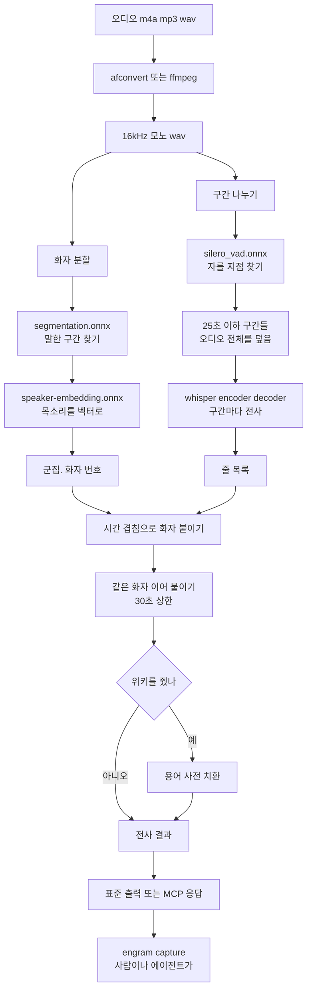

# engram-voice 동작 구조

오디오 파일 하나를 화자가 갈린 전사 텍스트로 바꾼다. 별도 모듈이고 선택 사항이다([0079](decisions/0079-voice-is-a-separate-binary-in-a-separate-repository.md), [0080](decisions/0080-voice-is-a-nested-module-in-this-repository.md)).

**위키에 쓰지 않는다.** 전사 결과를 돌려줄 뿐이고 위키에 넣는 것은 `engram capture`가 한다. 그 경계가 이 문서 전체의 전제다.

## 전체 흐름

## 모델 넷

역할이 넷이고 파일이 여섯이다. 전부 `engram-voice model pull`이 받는다.

| 역할 | 파일 | 크기 | 무엇을 하나 |
|---|---|---|---|
| 전사 | `encoder.int8.onnx`, `decoder.int8.onnx`, `tokens.txt` | 1.69GB | whisper large-v3 int8. 소리를 글자로 |
| 화자 구간 | `segmentation.onnx` | 5.7MB | pyannote-segmentation-3.0. 누가 말하는 구간인지 |
| 화자 임베딩 | `speaker-embedding.onnx` | 27MB | 3D-Speaker campplus. 목소리를 벡터로 |
| 자를 지점 | `silero_vad.onnx` | 629KB | 말과 침묵을 갈라 자를 자리를 고름 |

large-v3 기준 총 1.7GB다. `--model medium`(0.90GB)과 `--model small`(0.36GB)이 있으며 대가는 [0081](decisions/0081-default-whisper-model-is-large-v3.md)의 표에 있다.

크기와 sha256을 코드에 박고 받을 때 검증한다. **모델이 바뀌면 결과가 바뀌므로 무엇을 받았는지가 고정되어야 한다.**

### 왜 넷인가

전사에 하나, 화자 분할에 둘이면 셋이다. 넷째인 VAD가 붙는 이유가 구현 사정에 있다.

whisper는 30초 창을 본다. 참조 구현(mlx-whisper)은 긴 오디오를 자기가 잘라 처리하지만 **sherpa-onnx 바인딩은 그 자름을 해 주지 않는다.** 그래서 우리가 먼저 잘라 넣어야 하고, 아무 데서나 자르면 낱말이 끊기므로 침묵 지점을 골라야 한다. VAD가 그 일만 한다.

**VAD 로 말 구간만 골라 넘기지 않는다.** 자를 지점을 고르는 데만 쓰고 오디오 전체를 덮는 구간으로 나눈다. 말 구간만 넘겼다가 402초 오디오의 61%만 덮은 채로 모델을 비교한 적이 있고, 놓친 대목이 어려운 쪽에 몰려 결과가 기울었다([0081](decisions/0081-default-whisper-model-is-large-v3.md)).

## 단계별로

### 1. 변환

`afconvert`(macOS 기본) 또는 `ffmpeg`를 부른다. 16kHz 모노 16비트 wav 로 만든다. 전사와 화자 분할이 그 형식만 받는다.

**직접 디코딩하지 않는다.** m4a 와 mp3 를 순수 Go 로 푸는 길이 없고 코덱을 하나 더 들이면 네이티브 의존이 늘어난다. 이미 wav 인 파일은 변환기가 없어도 쓸 수 있다.

| 플랫폼 | 필요한 것 |
|---|---|
| macOS | 없음. `afconvert`가 기본 |
| Linux, Windows | **`ffmpeg`가 PATH 에 있어야 한다** |

### 2. 화자 분할

`segmentation.onnx`가 말한 구간을 찾고, 구간마다 `speaker-embedding.onnx`가 목소리를 벡터로 만들고, 그 벡터를 군집해 화자 번호를 붙인다.

**화자 수는 사람에게 묻는다**([0082](decisions/0082-speaker-count-is-asked-not-guessed.md)). `--speakers`를 주면 그 수로 군집하고, 안 주면 거리 임계값 0.70 으로 가른 뒤 경고를 낸다. 그 임계값과 파편 필터 하한 2%는 화자 수를 아는 실제 사람 녹음 다섯으로 쟀다([0092](decisions/0092-diarization-thresholds-are-measured-against-real-recordings.md)). 추정이 긴 녹음에서 무너지기 때문이다. 실측으로 120분 녹음이 화자 132명을 냈다.

추정한 값은 산출물에도 남는다. 전사가 그대로 위키 문서가 되므로 나중에 읽는 사람도 그 숫자가 지어낸 것인지 알아야 한다.

**이름은 붙이지 않는다.** `화자 1`, `화자 2`다. 도구는 목소리가 몇 갈래인지만 알고 누구인지는 모른다.

### 3. 전사

구간마다 whisper 를 돌린다. 언어는 `ko` 로 고정한다. 짧은 구간에서 언어를 잘못 잡으면 그 구간이 통째로 엉뚱한 글자가 되고, 위키가 한국어라 감지가 줄 이득이 없다.

빈 결과가 나온 구간은 버린다. whisper 가 침묵이나 잡음에 빈 문자열을 내는데 그것을 줄로 남기면 전사가 빈 줄로 뒤덮인다.

속도는 녹음 길이의 절반에서 팔 할이다. 순수 CPU 이며 실측으로 6.7분에 3.4분, 9.8분에 7.5분이다.

### 4. 화자 붙이기

전사 줄과 화자 구간을 시간으로 겹쳐 가장 많이 겹치는 화자를 붙인다. 겹치는 화자가 없으면 `화자 미상`이 되고 그것은 오류가 아니라 모른다는 뜻이다.

그다음 같은 화자의 이어지는 줄을 합치되 30초를 넘기지 않는다. **길이 상한이 필요한 이유는 구간 사이 간격이 항상 0이기 때문이다.** 구간이 오디오 전체를 덮으므로 앞 구간의 끝이 다음 구간의 시작이고, 간격만 보고 합치면 "같은 화자면 무조건 합침"이 되어 6.7분 대화가 다섯 줄이 된다.

### 5. 용어 교정

`--wiki`를 준 때만 돈다. 위키의 `meta/terminology.md`(없으면 `meta/terminology-normalization.md`)를 읽어 셋째 칸이 `yes`로 시작하는 항목만 치환한다([0083](decisions/0083-the-glossary-corrects-after-the-fact-and-grows-against-one-model.md)).

**전사 뒤에만 한다.** 인식 단계에서 용어를 유도하는 길이 sherpa-onnx 에 없다. whisper 설정에 프롬프트 자리가 없고 `hotwords`는 transducer 계열의 것이다.

읽은 규칙 수와 맞은 규칙 수와 교정 건수를 함께 낸다. 바꾼 것은 산출물에도 목록으로 남긴다. 조용히 바꾸면 검수하는 사람이 도구가 손댄 자리를 모른다.

**사전은 쓰는 모델에 붙어 자란다.** 사전은 정확히 일치하는 문자열만 바꾸므로 그 오인식이 이미 등재되어 있어야 잡는다. 모델을 바꾸면 틀리는 방식이 달라져 상당 부분이 안 통한다.

## 두 가지 진입점

같은 함수를 부른다. 절차를 두 벌 두면 한쪽만 고쳐지고 그 차이를 아무도 못 본다.

| | 커맨드 | 누가 쓰나 |
|---|---|---|
| CLI | `engram-voice transcribe <오디오>` | 사람. 한 번 돌려 보거나 파이프로 잇는다 |
| MCP | `engram-voice mcp` | **에이전트.** 도구 `transcribe`, `model_status` |

MCP 쪽이 실제 동선이다. 사람이 회의 녹음을 손으로 전사하고 손으로 위키에 넣는 일은 잘 일어나지 않는다.

규약은 스킬 문서 한 벌이 갖는다. `engram mcp` 가 그것을 `instructions` 로 통째로 내고 `engram-voice mcp` 는 자기 경계 넷만 짧게 낸다([0090](decisions/0090-the-skill-document-is-the-source-and-mcp-delivers-it-as-instructions.md)). 도구 설명에는 절차 규칙을 적지 않는다.

stdio 전송 하나이며 stdout 은 프로토콜 전용이다. 진행률과 경고는 전부 stderr 로 간다. 전사가 몇 분씩 걸려 진행률이 중요한데 그것이 stdout 으로 새면 JSON-RPC 가 깨져 서버가 조용히 죽는다.

## 출력 언어

`--lang ko` 또는 `--lang en` 으로 고른다. `ENGRAM_LANG` 환경변수도 같은 일을 하며 우선순위는 플래그, 환경변수, 한국어 순이다. 본체와 같은 규칙이고 카탈로그도 본체의 `internal/i18n` 을 함께 쓴다.

`--lang` 은 커맨드 앞뒤 어디에 와도 받는다. 하위 커맨드마다 플래그 집합이 달라 진입점에서 한 번 걷어낸다.

두 가지가 아직 한국어다.

| | 왜 |
|---|---|
| MCP 도구 인자 설명 | 구조체 태그라 컴파일 시점에 고정된다. 도구 설명 자체는 언어를 따른다 |
| `internal/` 의 저수준 오류 | 본체도 같은 자리를 한국어로 두고 있다. 옮기려면 본체와 함께 옮긴다 |

## upstream 과 다른 점

upstream `llm-wiki`의 `scripts/voice_memo_local_stt.py`가 같은 일을 한다. 이 저장소는 그 체계를 Go 로 옮긴 것이므로 차이를 적어 둔다.

| | upstream | engram-voice |
|---|---|---|
| 전사 엔진 | mlx-whisper large-v3 **fp16** | sherpa-onnx whisper large-v3 **int8** |
| 화자 분할 | 같은 pyannote + campplus | 같음 |
| VAD | 없음. mlx 가 자름 | **필요.** 바인딩이 안 잘라 줌 |
| 순서 | 전사 먼저, 화자 분할을 따로 | 화자 분할 먼저, 전사는 VAD 구간마다 |
| 용어 사전 | 인식 유도(`initial_prompt`) **와** 후처리 치환 | **후처리 치환만** |
| 화자 수 | 후보 노트 frontmatter 의 `expected_speakers` | `--speakers` 또는 MCP 인자 |
| 산출물 | 파일 다섯. `cleaned`, `normalized`, `diarized`, `diarization.tsv`, 회의록 프롬프트 | 전사 하나. 표준 출력 또는 MCP 응답 |
| 마지막 단계 | 회의록 초안 프롬프트를 파일로 남김 | **없음.** 에이전트가 스킬 문서를 따름 |

양자화 차이가 품질 차이를 만든다. 기준 전사본과의 문자 일치율이 61%에서 86%다([0081](decisions/0081-default-whisper-model-is-large-v3.md)). 그리고 틀리는 방식이 달라 upstream 사전이 우리 전사에는 안 통한다([0083](decisions/0083-the-glossary-corrects-after-the-fact-and-grows-against-one-model.md)).

## 플랫폼

| 대상 | 빌드 | 시험 | 릴리스 | 실제 전사를 돌려 봤나 |
|---|---|---|---|---|
| darwin/arm64 | CI | CI | 있음 | **CI** |
| darwin/amd64 | 릴리스만 | 없음 | 있음 | 없음 |
| linux/amd64 | CI | CI | 있음 | **CI** |
| linux/arm64 | 릴리스만 | 없음 | 있음 | 없음 |
| windows/amd64 | CI | CI | 있음 | **CI** |
| windows/arm64 | **불가** | | | |

windows/arm64 는 sherpa-onnx 모듈에 그 트리플의 라이브러리가 없어 성립하지 않는다([0086](decisions/0086-runner-labels-are-checked-and-windows-is-measured-in-ci.md)).

CI 가 러너 셋에서 실제 오디오를 한 번씩 전사한다([0093](decisions/0093-ci-runs-a-real-transcription-on-every-runner.md)). 화자 수를 아는 16초짜리 표본을 넣고 화자 둘과 비어 있지 않은 본문을 확인한다. 모델은 392MB 인 small 을 쓰며 본문 글자는 보지 않는다. 전사 언어가 한국어로 박혀 있어 영어 오디오의 본문에 뜻이 없기 때문이다.

**릴리스만 하는 둘(darwin/amd64, linux/arm64)은 그대로 안 돌려 봤다.** 그 러너가 CI 에 없다. 그리고 잰 것은 small 이라 large-v3 에서만 나는 결함은 이 검사가 못 본다.

배포는 바이너리와 `lib/` 둘이다. 단일 바이너리가 아니다([0081](decisions/0081-default-whisper-model-is-large-v3.md), [0084](decisions/0084-voice-ships-on-fewer-platforms-than-engram.md)).

## 관련

- [0079 음성은 별도 바이너리이고 위키는 용어 사전을 소유한다](decisions/0079-voice-is-a-separate-binary-in-a-separate-repository.md)
- [0080 음성은 이 저장소의 중첩 모듈이다](decisions/0080-voice-is-a-nested-module-in-this-repository.md)
- [0081 기본 whisper 모델은 large-v3이고 배포는 단일 바이너리가 아니다](decisions/0081-default-whisper-model-is-large-v3.md)
- [0082 화자 수는 사람에게 묻고 추정치에는 신뢰할 수 없다고 적는다](decisions/0082-speaker-count-is-asked-not-guessed.md)
- [0083 용어 사전은 후처리만 하고 쓰는 모델에 붙어 자란다](decisions/0083-the-glossary-corrects-after-the-fact-and-grows-against-one-model.md)
- [0092 화자 분할 임계값을 실제 사람 녹음으로 잰다](decisions/0092-diarization-thresholds-are-measured-against-real-recordings.md)
- [0093 CI가 러너마다 실제 전사를 한 번 돌린다](decisions/0093-ci-runs-a-real-transcription-on-every-runner.md)
- [architecture.md](architecture.md) engram 본체의 동작 구조
- [course/hands-on.md](course/hands-on.md) 선택 단계 실습
